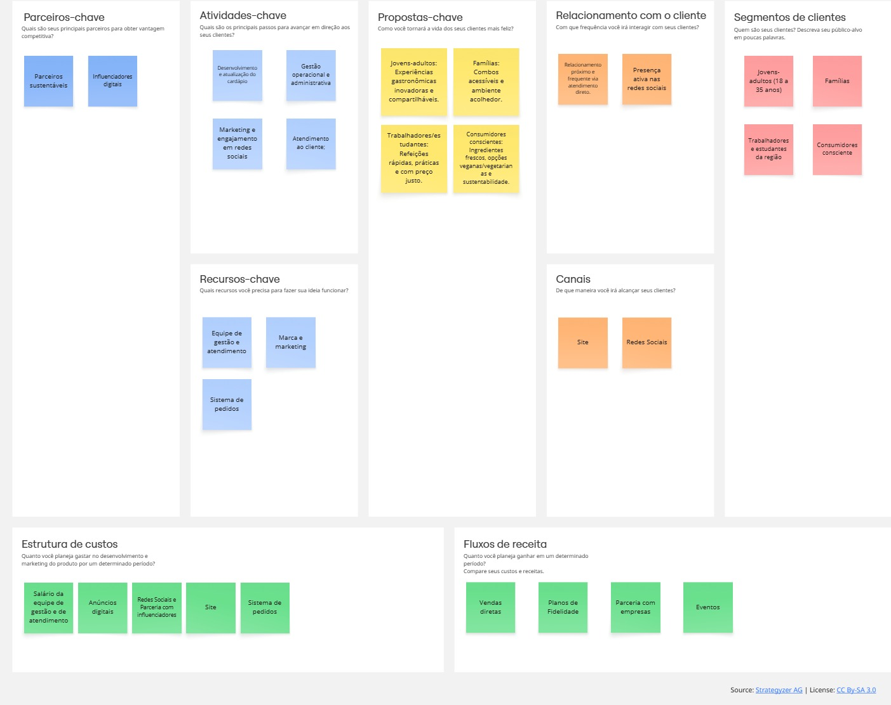

# Especificação do projeto

Pré-requisitos: <a href="01-Contexto.md"> Documentação de contexto</a>

## Modelo de negócio (*Business Model Canvas*)

     
## Personas

## Histórias de usuários
Com base na análise das personas, foram identificadas as seguintes histórias de usuários:

|EU COMO... `PERSONA`| QUERO/PRECISO ... `FUNCIONALIDADE` |PARA ... `MOTIVO/VALOR`|
|--------------------|------------------------------------|------------------------|
|Cliente | Visualizar o cardápio digital atualizado | Escolher rapidamente o que pedir sem precisar perguntar ao atendente |
|Cliente | Ver fotos e descrições dos lanches | Entender os ingredientes antes de decidir a compra |
|Cliente | Ter informações sobre preços e tamanhos das porções | Planejar o pedido dentro do orçamento |
|Cliente | Filtrar opções (vegetarianos, combos, promoções) | Encontrar mais facilmente o que me interessa |
|Cliente | Acessar o cardápio pelo celular via QR Code | Não precisar baixar nenhum aplicativo |
|Cliente | Deixar meu contato ao fazer o pedido | Receber aviso de quando o lanche estiver pronto |
|Cliente | Ver informações sobre oficinas de pães artesanais | Participar caso tenha interesse |
|Cliente | Que o menu digital carregue rápido | Não perder tempo esperando |
|Cliente | Que a interface seja simples e clara | Conseguir usar mesmo sem familiaridade com tecnologia |

|EU COMO... `PERSONA`| QUERO/PRECISO ... `FUNCIONALIDADE` |PARA ... `MOTIVO/VALOR`|
|--------------------|------------------------------------|------------------------|
|Atendente | Visualizar em tempo real os pedidos feitos no sistema | Preparar e organizar a retirada |
|Atendente | Marcar um pedido como “em preparo” ou “pronto” | Organizar a comunicação com os clientes |
|Atendente | Acessar observações especiais do cliente (ex: retirar cebola, ponto da carne) | Preparar o pedido corretamente |

|EU COMO... `PERSONA`| QUERO/PRECISO ... `FUNCIONALIDADE` |PARA ... `MOTIVO/VALOR`|
|--------------------|------------------------------------|------------------------|
|Administrador | Cadastrar e atualizar produtos no menu (nome, preço, foto, ingredientes) | Manter o cardápio sempre atualizado |
|Administrador | Ativar/desativar produtos rapidamente | Controlar itens disponíveis conforme o estoque |
|Administrador | Cadastrar datas e horários das oficinas de pães artesanais | Divulgar aos clientes no cardápio digital |
|Administrador | Visualizar relatórios de pedidos realizados | Entender o que mais vende e planejar compras |
|Administrador | Que o sistema seja seguro | Evitar acessos não autorizados e alterações indevidas no cardápio |

Os clientes precisam de praticidade e clareza para acessar o cardápio atualizado, com preços, fotos e filtros, além de comunicação eficiente sobre o status do pedido.
Os atendentes enfrentam falta de organização e desejam visualizar pedidos em tempo real, com status e observações dos clientes para evitar erros.
Os administradores sentem dor na gestão manual do cardápio e estoque, precisando de um sistema centralizado para atualizar itens, divulgar oficinas e gerar relatórios.
De forma geral, as dores concentram-se em agilidade, clareza, controle e segurança, garantindo melhor experiência para clientes e eficiência para a equipe.

## Requisitos

As tabelas a seguir apresentam os requisitos funcionais e não funcionais que detalham o escopo do projeto. Para determinar a prioridade dos requisitos, aplique uma técnica de priorização e detalhe como essa técnica foi aplicada.

### Requisitos funcionais

|ID    | Descrição do Requisito  | Prioridade |
|------|-----------------------------------------|----|
|RF-001| Cadastro | ALTA |
|RF-002| Login | ALTA |
|RF-003| CRUD Produtos | ALTA |
|RF-004| Visualizar cardápio | ALTA | 
|RF-005| Vizualizar detalhes do produto | ALTA |  
|RF-006| Filtrar cardápio e busca no cardápio | MÉDIA |
|RF-007| Buscar produto no cardápio | MÉDIA |
|RF-008| Carrinho de Compras | ALTA |
|RF-009| Processo de Pedido (Checkout) | ALTA |
|RF-010| Acompanhar status do pedido | ALTA |
|RF-011| Gerenciar pedidos  | ALTA |
|RF-012| Ordenar produtos cadastrados | BAIXA |
|RF-013| Buscar de produtos cadastrados | BAIXA |
|RF-014| CRUD Oficinas | MÉDIA |
|RF-015| Vizualizar oficinas | MÉDIA |  
|RF-016| Vizualizar detalhes da oficina | MÉDIA |  
|RF-017| Inscrever na Oficina | MÉDIA |
|RF-018| Visualizar inscrições nas oficinas | MÉDIA |
|RF-019| Histórico de pedidos do cliente | MÉDIA |   
|RF-020| Gerenciamento de Conteúdo | BAIXA |

### Requisitos não funcionais

|ID     | Descrição do Requisito  |Prioridade |
|-------|-------------------------|----|
|RNF-001| Usabilidade e Experiência do Usuário (UX) | ALTA | 
|RNF-002| Desempenho | ALTA | 
|RNF-003| Confiabilidade e Disponibilidade | ALTA | 
|RNF-004| Interface inclusiva | MÉDIA | 
|RNF-005| Interatividade fluida | MÉDIA |
|RNF-006| Manutenibilidade | MÉDIA |

## Restrições  

O projeto está restrito aos itens apresentados na tabela a seguir.  

| ID  | Restrição                                                                 |
|-----|---------------------------------------------------------------------------|
| 01  | O projeto deve seguir os prazos de entrega estipulados até o final do semestre. |
| 02  | O sistema precisa ser intuitivo para usuários de diferentes idades e níveis tecnológicos. |
| 03  | O cardápio digital deverá estar disponível apenas em ambiente web, acessível via navegador. |
| 04  | O sistema precisa estar disponível em língua portuguesa, sem suporte multilíngue nesta versão. |
| 05  | O software deverá permitir apenas a consulta ao cardápio pelos clientes, sem possibilidade de pedidos diretos. |
| 06  | A atualização dos itens do cardápio poderá ser feita apenas por um usuário administrador. |
| 07  | O sistema não terá integração com meios de pagamento online nesta versão inicial. |
| 08  | O acesso simultâneo ao sistema será limitado a um número reduzido de usuários (até 20). |
| 09  | O sistema dependerá de conexão ativa com a internet, não possuindo suporte offline. |
| 10  | A interface será otimizada para telas de computadores e tablets, podendo apresentar limitações em dispositivos móveis. |
| 11  | O código-fonte deverá ser versionado e armazenado em repositório acessível à equipe de desenvolvimento. |
