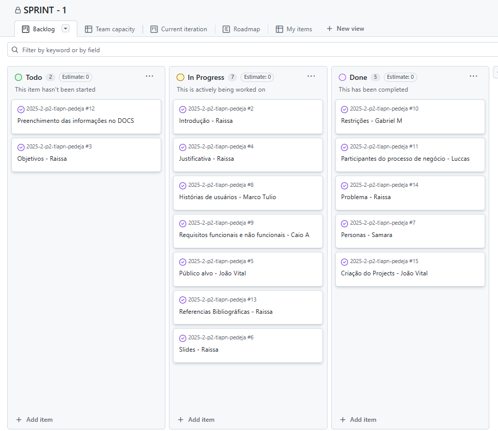
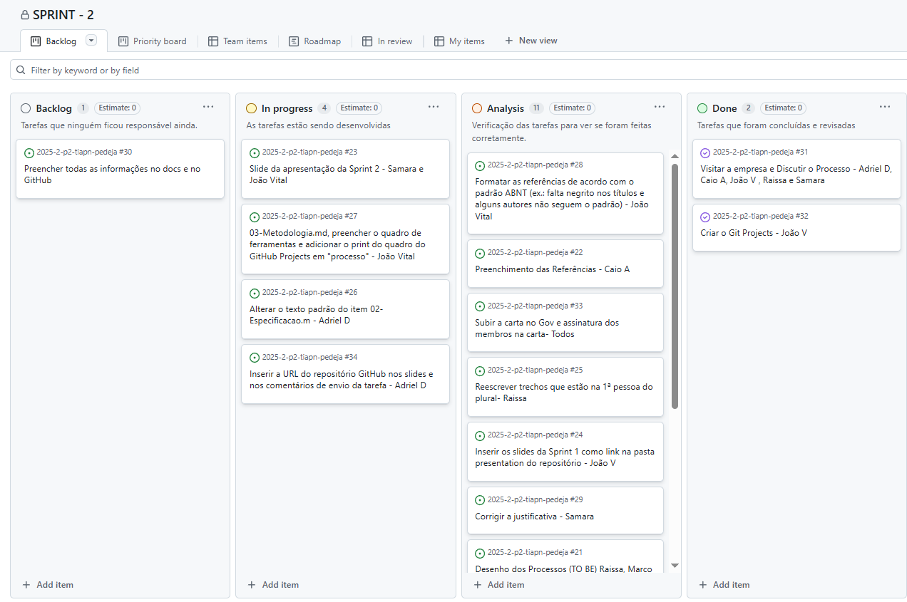
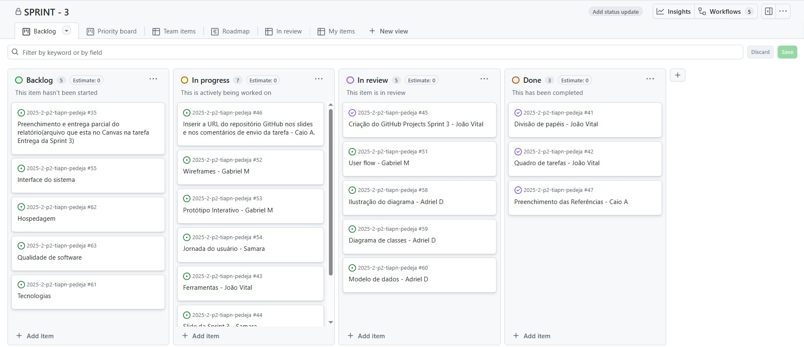
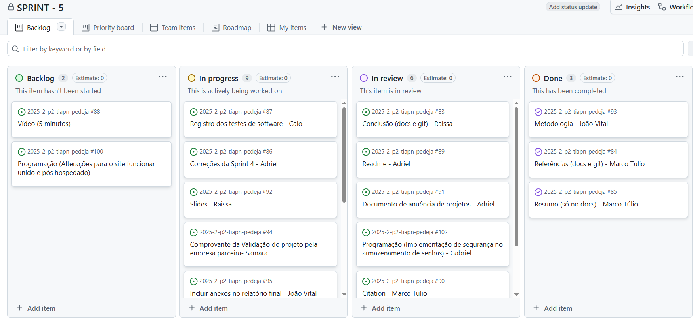

# Metodologia

Pré-requisitos: <a href="02-Especificacao.md"> Especificação do projeto</a>

## Controle de versão

A ferramenta de controle de versão adotada no projeto foi o [Git](https://git-scm.com/), sendo que o [GitHub](https://github.com) foi utilizado para hospedagem do repositório.

O projeto segue a seguinte convenção para o nome de branches:

- `main`: versão estável já testada do software
- `unstable`: versão já testada do software, porém instável
- `testing`: versão em testes do software
- `dev`: versão de desenvolvimento do software

Quanto à gerência de issues, o projeto adota a seguinte convenção para etiquetas:

- `documentation`: melhorias ou acréscimos à documentação
- `bug`: uma funcionalidade encontra-se com problemas
- `enhancement`: uma funcionalidade precisa ser melhorada
- `feature`: uma nova funcionalidade precisa ser introduzida

Discuta como a configuração do projeto foi feita na ferramenta de versionamento escolhida. Exponha como a gestão de tags, merges, commits e branches é realizada. Discuta também como a gestão de issues foi feita.

> **Links úteis**:
> - [Tutorial GitHub](https://guides.github.com/activities/hello-world/)
> - [Git e GitHub](https://www.youtube.com/playlist?list=PLHz_AreHm4dm7ZULPAmadvNhH6vk9oNZA)
> - [Comparando fluxos de trabalho](https://www.atlassian.com/br/git/tutorials/comparing-workflows)
> - [Understanding the GitHub flow](https://guides.github.com/introduction/flow/)
> - [The gitflow workflow - in less than 5 mins](https://www.youtube.com/watch?v=1SXpE08hvGs)

## Planejamento do projeto

###  Divisão de papéis

#### Sprint 1
- _Scrum master_: Raissa
- Product Owner: Adrie-l
- Analista de Requisitos: Caio A
- Time de Desenvolvimento: João V, Luccas, Gabriel M, Marco Túlio, Raissa, Samara.

#### Sprint 2
- _Scrum master_: Samara
- Product Owner: Adrie-l
- Analista de Negócios e Processos: Marco Túlio, Raissa, Luccas e Gabriel M
- Time de Suporte, Organização e Qualidade: João V, Caio A

#### Sprint 3
- _Scrum master_: Samara
- Product Owner: Marco Túlio
- Designer e Arquiteto Técnico: Gabriel M e Adriel Dias
- Time de Suporte, Organização e Qualidade: João V, Caio, Luccas, Raissa

#### Sprint 4
- _Srum master_: Samara
- Product Owner : Raissa
- Time de desenvolvimento : Gabriel M, Raissa, Samara, João Vital, Caio A , Adriel

#### Sprint 5
- _Srum master_: Samara
- Product Owner : Raissa
- Programação: Gabriel M, Samara, Caio 
- Time da documentação: Adriel, Marco Túlio, João Vital 

###  Quadro de tarefas

#### Sprint 1

Atualizado em: 04/09/2025

| Responsável   | Tarefa/Requisito | Iniciado em    | Prazo      | Status | Terminado em    |
| :----         |    :----         |      :----:    | :----:     | :----: | :----:          |
| Adriel        | Modelo de negócio (Business Model Canvas) | 29/08/2025     | 04/09/2025 | ✔️    | 03/08/2025      |
| Caio A        | Requisitos funcionais e não funcionais | 29/08/2025     | 04/09/2025 | ✔️    | 03/08/2025      |
| Gabriel M     | Restrições | 29/08/2025     | 04/09/2025 | ✔️    | 03/08/2025      |
| João V        | Público alvo | 29/08/2025     | 04/09/2025 | ✔️    | 03/08/2025      |
| João V        | Criar git projects | 29/08/2025     | 04/09/2025 | ✔️    | 01/08/2025      |
| Luccas        | Participantes do processo de negócio | 29/08/2025     | 04/09/2025 | ✔️    | 03/08/2025      |
| Marco Túlio   | Histórias de usuário  | 01/09/2025     | 04/09/2025 |  ✔️   | 30/08/2025                |
| Raissa        | Introdução | 19/08/2025     | 04/09/2025 | ✔️    | 03/08/2025      |
| Raissa        | Objetivos    | 19/08/2025     | 04/09/2025 | ✔️ |  03/09/2025               |
| Raissa        | Slides | 30/08/2025     | 04/09/2025 | ✔️    | 01/08/2025      |
| Raissa        | Justificativa | 29/08/2025     | 04/09/2025 | ✔️    | 01/08/2025      |
| Raissa        | Referencias Bibliográficas | 30/08/2025     | 04/09/2025 | ✔️    | 01/08/2025      |
| Raissa        | Problema | 29/08/2025     | 04/09/2025 | ✔️    | 01/08/2025      |
| Samara        | Objetivos  |    19/08/2025        | 04/09/2025 | ✔️  |  03/09/2025  |
| Samara        | Personas  |    01/09/2025        | 04/09/2025 | ✔️  |  03/09/2025  |
| Samara        | Divisão de papeis e quadro de tarefas | 29/08/2025     | 04/09/2025 | ✔️    | 04/08/2025      |
| Todos        | Preenchimento das informações no DOCS | 03/09/2025     | 04/09/2025 | ✔️    | 04/08/2025      |

#### Sprint 2

Atualizado em: 02/10/2025

| Responsável   | Tarefa/Requisito | Iniciado em    | Prazo      | Status | Terminado em    |
| :----         |    :----         |      :----:    | :----:     | :----: | :----:          |
| Adriel        | Visitar a empresa e Discutir o Processo |  13/09/2025    | 02/10/2025 | ✔️    |  26/09/2025       |
| Adriel        | Alterar o texto padrão do item 02-Especificacao.m |  01/09/2025    | 02/10/2025 | ✔️     | 27/09/2025      |
| Adriel        | Inserir a URL do repositório GitHub nos slides e nos comentários de envio da tarefa |  01/09/2025    | 02/10/2025 | ✔️     | 01/10/2025      |
| Caio A        | Visitar a empresa e Discutir o Processo |  13/09/2025    | 02/10/2025 | ✔️    |  26/09/2025       |
| Caio A        | Preenchimento das Referências  |  01/09/2025    | 02/10/2025 | ✔️      | 01/10/2025      |
| Gabriel M     |Análise dos processos  |  26/09/2025    | 02/10/2025 |  ✔️     | 30/09/2025       |
| Gabriel M     |Preencher todas as informações no docs e no GitHub  |  00/09/2025    | 02/10/2025 | ✔️    | 01/10/2025      |
| João V        | Visitar a empresa e Discutir o Processo |  13/09/2025    | 02/10/2025 | ✔️    |  26/09/2025       |
| João V        | Divisão de papéis| 26/09/2025     | 02/10/2025 | ✔️    | 26/09/2025                |
| João V        | Quadro de tarefas| 26/09/2025     | 02/10/2025 | ✔️    |  26/09/2025               |
| João V        |03-Metodologia.md, preencher o quadro de ferramentas e adicionar o print do quadro do GitHub Projects em "processo"| 28/09/2025     | 02/10/2025 |  ✔️     |  01/10/2025|
| João V        |Formatar as referências de acordo com o padrão ABNT | 26/09/2025     | 02/10/2025 | ✔️    | 26/09/2025       |
| João V        |Inserir os slides da Sprint 1 como link na pasta presentation do repositório | 26/09/2025     | 02/10/2025 | ✔️    | 26/09/2025       |
| Luccas        | Desenho dos Processos (TO BE)  | 01/09/2025     | 02/10/2025 | ✔️     | 28/09/2025 |
| Marco Túlio   |Modelagem da situação atual (Modelagem AS IS)  |  27/09/2025    | 02/10/2025 | ✔️    | 27/09/2025      |
| Marco Túlio   |Desenho dos Processos (TO BE)  |  27/09/2025    | 02/10/2025 | ✔️    |   29/09/2025    |
| Raissa        | Visitar a empresa e Discutir o Processo |  13/09/2025    | 02/10/2025 | ✔️    |  26/09/2025       |
| Raissa        |Modelagem da situação atual (Modelagem AS IS)   |  27/09/2025    | 02/10/2025 | ✔️    | 29/09/2025       |
| Raissa        |Desenho dos Processos (TO BE)   |  27/09/2025    | 02/10/2025 | ✔️    |  29/09/2025      |
| Raissa        |Reescrever trechos que estão na 1ª pessoa do plural   |  14/09/2025    | 02/10/2025 | ✔️    | 25/09/2025        |
| Samara        | Visitar a empresa e Discutir o Processo |  13/09/2025    | 02/10/2025 | ✔️    |  26/09/2025       |
| Samara        |Slide da apresentação   | 28/09/2025     | 02/10/2025 | ✔️    | 30/09/2025       |
| Raissa       |Corrigir a justificativa   | 13/09/2025     | 02/10/2025 | ✔️    |  29/09/2025      |
| Todos        |Subir a carta no Gov e assinatura dos membros na carta   | 29/09/2025     | 02/10/2025 | ✔️    | 01/10/2025      |

#### Sprint 3

Atualizado em: 23/10/2025

| Responsável   | Tarefa/Requisito | Iniciado em    | Prazo      | Status | Terminado em    |
| :----         |    :----         |      :----:    | :----:     | :----: | :----:          |
| Adriel        | Modelo de dados(Conceitual e Relacional)  | 11/10/2025     | 23/10/2025 |  ✔️   | 22/10/2025     |
| Caio A        | Inserir a URL do repositório GitHub nos slides e nos comentários de envio da tarefa | 14/10/2025     | 23/10/2025 |  ✔️   | 23/10/2025     |
| Caio A        | Preenchimento das Referências | 14/10/2025     | 23/10/2025 |  ✔️   |  22/10/2025    |
| Gabriel M     | User flow | 14/10/2025     | 23/10/2025 | ✔️    | 17/10/2025      |
| Gabriel M     | Protótipo Interativo | 14/10/2025     | 23/10/2025 | ✔️    | 19/10/2025      |
| Gabriel M     | Wireframes| 14/10/2025     | 23/10/2025 | ✔️    |  19/10/2025     |
| Gabriel M     | Interface do sistema| 14/10/2025     | 23/10/2025 | ✔️    |  19/10/2025     |
| João V        | Divisão de papéis | 10/10/2025     | 23/10/2025 |  ✔️   | 18/10/2025    |
| João V        | Quadro de tarefas | 10/10/2025     | 23/10/2025 |  ✔️   | 18/10/2025    |
| João V        | Criação do GitHub Projects Sprint | 10/10/2025     | 23/10/2025 |  ✔️   | 18/10/2025    |
| João V        | Ferramentas| 10/10/2025     | 23/10/2025 |  ✔️   |  23/10/2025   |
| João V        | Ilustração do diagrama da Arquitetura da Solução | 10/10/2025     | 23/10/2025 |  ✔️   | 23/10/2025    |
| João V        | Diagrama de classes | 10/10/2025     | 23/10/2025 |  ✔️   | 23/10/2025    |
| João V        | Correção-Documento extensionista deformatado, implementação das fotos da visita e colocar o documento na pasta atas | 10/10/2025     | 23/10/2025 |  ✔️   | 22/10/2025    |
| João V        | Correção-(Pasta presentation)links dos slides  | 10/10/2025     | 23/10/2025 |  ✔️   | 22/10/2025    |
| João V        | Correção-Retornar o texto de pré-requisitos do item 02-Especificação | 10/10/2025     | 23/10/2025 |  ✔️   | 22/10/2025    |
| ...        | Correção- Link da ferremanta Mirio Modelo de negócio | 10/10/2025     | 23/10/2025 |  ✔️   | 22/10/2025    |
| João V        | Correção- Referencias Bibliograficas | 10/10/2025     | 23/10/2025 |  ✔️   | 23/10/2025    |
| Luccas        | Template padrão da aplicação |  10/10/2025    | 23/10/2025 | ✔️     | 23/10/2025      |
| Marco Túlio   | Preenchimento e entrega parcial do relatório  | 10/10/2025     | 23/10/2025 | ✔️    |  23/10/2025  |
| Raissa        | Modelo de dados(Fisico) |  20/10/2025   | 23/10/2025 | ✔️     |  22/10/2025    |
| Raissa        | Correção- Modelagem-processos AS IS e TO BE |  20/10/2025   | 23/10/2025 | ✔️     |  22/10/2025    |
| Samara        | Slide  | 09/10/2025 | 23/10/2025 | ✔️   | 22/10/2025   |
| Samara        | Jornada do usuário| 17/10/2025 | 23/10/2025 | ✔️   | 23/10/2025  |

#### Sprit 4

Atualizado em: 27/11/2025

| Responsável   | Tarefa/Requisito | Iniciado em    | Prazo      | Status | Terminado em    |
| :----         |    :----         |      :----:    | :----:     | :----: | :----:          |
| Adriel        | Página de login/ Cadastro | 14/11/2025     | 27/11/2025 | ✔️    | 27/11/2025      |
| Caio A    | Página e a de  Painel de Acompanhamento de pedidos(adm) | 14/11/2025     | 27/11/2025 | ✔️    | 27/11/2025      |
| Gabriel M   | Página de carrinho/pedido,status| 31/10/2025     | 27/11/2025 | ✔️    | 27/11/2025      |
| João V        | Página de vizualização/detalhe/gerenciamento de oficinas | 14/11/2025     | 27/11/2025 |  ✔️   | 27/11/2025    |
| Marco Túlio   | Página de gerenciamento incrições de oficinas/inscrição para oficina  | 23/11/2025     | 27/11/2025 |  ✔️   | 27/11/2025   
| Raissa     | Github projects | 22/11/2025     | 27/11/2025 | ✔️    | 27/11/2025      |
| Raissa     | Página de Cardápio | 22/11/2025     | 27/11/2025 | ✔️    | 27/11/2025      |
| Raissa     | Quadro de divisão de tarefas | 22/11/2025     | 27/11/2025 | ✔️    | 27/11/2025      |
| Samara    | Apresentação Slide | 22/11/2025     | 27/11/2025 | ✔️    | 27/11/2025      |
| Samara   | Página de cadastro de produto | 14/11/2025     | 27/11/2025 | ✔️    | 27/11/2025      |

#### Sprint 5

Atualizado em: 18/12/2025

| Responsável   | Tarefa/Requisito | Iniciado em    | Prazo      | Status | Terminado em    |
| :----         |    :----         |      :----:    | :----:     | :----: | :----:          |
| Adriel        | Correções da Sprint 4  |  10/12/2025     | 18/12/2025 | ✔️ | 18/12/2025 |
| Adriel        |Readme  | 10/12/2025 | 18/12/2025 | ✔️ | 18/12/2025 |
| Adriel        |Documentos de anuência de projetos |   10/12/2025 | 18/12/2025 | ✔️ | 18/12/2025 |
| Caio A        | Registro dos testes de software | 10/12/2025 | 18/12/2025 | ✔️ | 18/12/2025 |
| Caio A  | Vídeo | 10/12/2025 | 18/12/2025 | ✔️ | 18/12/2025 |
| Gabriel M     | Programação(Implementação de segurança contra SQL Injection) |  10/12/2025 | 18/12/2025 | ✔️ | 18/12/2025 |
| Gabriel M     | Programação(Implementação de segurança no armazenamento de senhas) |  10/12/2025 | 18/12/2025 | ✔️ | 18/12/2025 |
| Gabriel M     | Programação (Alterações para o site funcionar unido e pós hospedado) |  10/12/2025 | 18/12/2025 | ✔️ | 18/12/2025 |
| Gabriel M  | Vídeo | 10/12/2025 | 18/12/2025 | ✔️ | 18/12/2025 |
| João V        | Metodologia | 10/12/2025 | 18/12/2025 | ✔️ | 18/12/2025 |
| João V        | Incluir anexos no relatório final/docs | 10/12/2025 | 18/12/2025 | ✔️ | 18/12/2025 |
| João V        | Revisar todo o repositório e ver o que precisa ajustar | 10/12/2025 | 18/12/2025 | ✔️ | 18/12/2025 |
| Marco Túlio   | Referências | 10/12/2025 | 18/12/2025 | ✔️ | 18/12/2025 |
| Marco Túlio   | Resumo |  10/12/2025    | 18/12/2025 | ✔️ | 18/12/2025 |
| Marco Túlio   | Citation |  10/12/2025  | 18/12/2025 | ✔️ | 18/12/2025 |
| Raissa        | Conclusão |  10/12/2025 | 18/12/2025 | ✔️ | 18/12/2025 |
| Raissa        | Slide |  10/12/2025 | 18/12/2025 | ✔️ | 18/12/2025 |
| Raissa        |  Programação (Alterações para o site funcionar unido e pós hospedado) |  10/12/2025 | 18/12/2025 | ✔️ | 18/12/2025 |
| Raissa | Vídeo | 10/12/2025 | 18/12/2025 | ✔️ | 18/12/2025 |
| Samara        | Validar projeto pela empresa parceira | 10/12/2025 | 18/12/2025 | ✔️ | 18/12/2025 |
| Samara        | Programação(Sobre nós e como doar) | 10/12/2025 | 18/12/2025 | ✔️ | 18/12/2025 |
| Samara        | Programação(Hospedagem) | 10/12/2025 | 18/12/2025 | ✔️ | 18/12/2025 |
| Samara        |  Programação(Home) |  10/12/2025 | 18/12/2025 | ✔️ | 18/12/2025 |
| Samara        |  Programação (Alterações para o site funcionar unido e pós hospedado) |  10/12/2025 | 18/12/2025 | ✔️ | 18/12/2025 |

Legenda:
- ✔️: terminado
- 📝: em execução
- ⌛: atrasado
- ❌: não iniciado

### Processo

Coloque informações sobre detalhes da implementação do Scrum seguido pelo grupo. O grupo deverá fazer uso do recurso de gerenciamento de projeto oferecido pelo GitHub, que permite acompanhar o andamento do projeto, a execução das tarefas e o status de desenvolvimento da solução.

### Sprint 1

### Sprint 2
 

### Sprint 3
 

### Sprint 4

### Sprint 5

## Ferramentas

Os artefatos do projeto são desenvolvidos a partir de diversas plataformas. A relação dos ambientes com seus respectivos propósitos deverá ser apresentada em uma tabela que especifique e detalhe Ambiente, Plataforma e Link de Acesso. Sempre que possível, inclua também frameworks, bibliotecas e demais tecnologias utilizadas, indicando seu uso em contextos específicos, como aplicações móveis, web ou outros.

Exemplo: os artefatos do projeto são desenvolvidos a partir de diversas plataformas e a relação dos ambientes com seu respectivo propósito é apresentada na tabela que se segue.

| Ambiente                            | Plataforma                         | Link de acesso                         |
|-------------------------------------|------------------------------------|----------------------------------------|
| Repositório de código fonte         | GitHub                             |https://github.com/ICEI-PUC-Minas-PCO-ADS-TI/2025-2-p2-tiapn-pedeja.git|
| Slides - Sprint 1                   | Canva                              | https://www.canva.com/design/DAG0SmouBnY/DK79ATKqnJRfX62lDB3v6A/edit?utm_content=DAG0SmouBnY&utm_campaign=designshare&utm_medium=link2&utm_source=sharebutton|
| Slides - Sprint 2                   | Gamma                              | https://gamma.app/docs/Revitalizacao-Digital-da-Hamburgueria-dyyh7sof05kejkr|
| Slides - Sprint 3                   | Gamma                              | https://gamma.app/docs/Revitalizacao-Digital-da-Hamburgueria-dyyh7sof05kejkr?mode=doc|
| Documentos do projeto               | GitHub                             | https://github.com/ICEI-PUC-Minas-PCO-ADS-TI/2025-2-p2-tiapn-pedeja.git|
| Documentos do projeto               | Google Docs                        | https://docs.google.com/document/d/1D-4bMh3n8lZXVZyyHyWKB-Ssuye7inZsaGXNoqSuljs/edit?tab=t.0|
| Gerenciamento do projeto - Sprint 1 | GitHub Projects                    | https://github.com/orgs/ICEI-PUC-Minas-PCO-ADS-TI/projects/61|
| Gerenciamento do projeto - Sprint 2 | GitHub Projects                    | https://github.com/orgs/ICEI-PUC-Minas-PCO-ADS-TI/projects/75|
| Gerenciamento do projeto - Sprint 3 | GitHub Projects                    | https://github.com/orgs/ICEI-PUC-Minas-PCO-ADS-TI/projects/89|
| Comunicação dos membros do grupo    | WhatsApp                           | https://chat.whatsapp.com/FB3K1XnKxpLAL5KpBBZmq3|
| Comunicação dos membros do grupo    | Teams                              | https://teams.microsoft.com/l/channel/19%3A3014446804134011aa40348b6563fb8f%40thread.tacv2/Grupo%206%20-%20ADS%20Contagem?groupId=4ccd9f91-0418-412e-84ec-3fb2c79219bd&tenantId=14cbd5a7-ec94-46ba-b314-cc0fc972a161&ngc=true                             |
| Modelagem AS IS                     | Heflo                               | https://app.heflo.com/Process/Editor    |
| Modelagem TO BE                     | Heflo                               | https://app.heflo.com/Process/Editor    |
| Modelo de negócio                   | Mirio                               | https://miro.com/welcomeonboard/TzhRWXpNL0ZUd056NkR2bXlYL3ZUcnBtM2l0UnptbmZKblBSeW42a2RWMnczajVrMHVZNXZLMEJWc3FuNTUxaXYvc1N1enU1VkFCTlk5OUhqcTdpeCsvWDFhM281YTRQZ1REL0w3QldSc0ViNGZub09sRkFqVk45UWdFTVZmNUJhWWluRVAxeXRuUUgwWDl3Mk1qRGVRPT0hdjE=?share_link_id=599216973870|
| Modelagem do Projeto de intarface   | Figma                               | https://www.figma.com/design/UorFcbfBTVIU2sHIwFHLb4/Untitled?node-id=0-1&t=g7r8VkxoLXGYLgfD-1|
| Diagrama de Classes| Mirio         | https://miro.com/app/board/uXjVJ2MWNbA=/?share_link_id=38446083945 |
| Diagrama da Arquitetura de Solução| Mirio         | https://miro.com/app/board/uXjVJ2NB7yU=/?share_link_id=84122390474 |
| Diagrama do Modelo Relacional| Mirio         | https://miro.com/welcomeonboard/VkdIbk9QNmpQcnRBQXlOaU1aY29OSzJoQmtBUUd1UmJSdnN1MDBIYnBZVVVpbnZXMmVrRExuK2Q0MFZmNnlSNUdnS3NiUWRtVkhqNUoyNWhpaHBYYSsvWDFhM281YTRQZ1REL0w3QldSc0hwM0ZmSGZJSks3OS90elVlSyt2NEp3VHhHVHd5UWtSM1BidUtUYmxycDRnPT0hdjE=?share_link_id=929292492413|
| Jornada do usuário| Mirio         | https://miro.com/app/board/uXjVJ1LzdmM=/?share_link_id=781612087451 |

