# Projeto de interface

 ## User flow

### Diagrama de fluxo

Os seguintes diagramas ilustram como será o fluxo a ser seguido por usuários na aplicação, sendo para os dois tipos de navegação entre cardápio e oficinas.

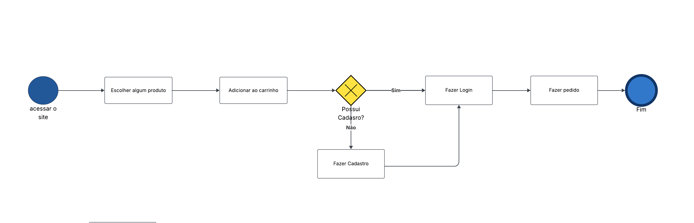
Neste diagrama se percebe o processo padrão de busca por produtos pelo usuário, podendo navegar entre eles e selecionar os de sua escolha.

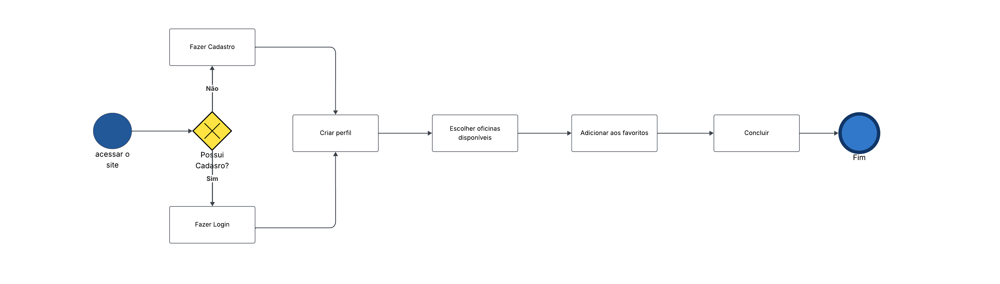
Neste diagrama se percebe o processo padrão de busca por oficinas pelo usuário, podendo navegar entre elas e selecionar as de sua escolha.

## Wireframes

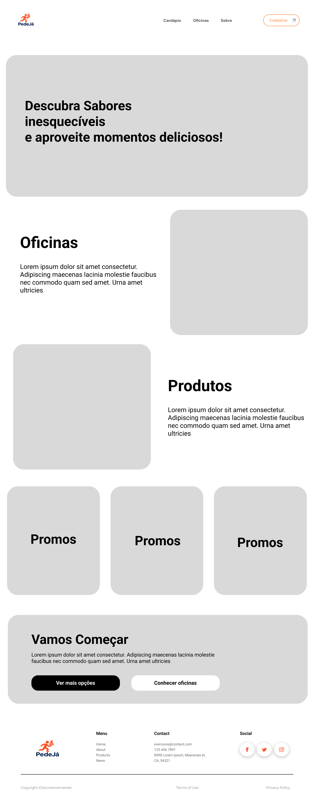

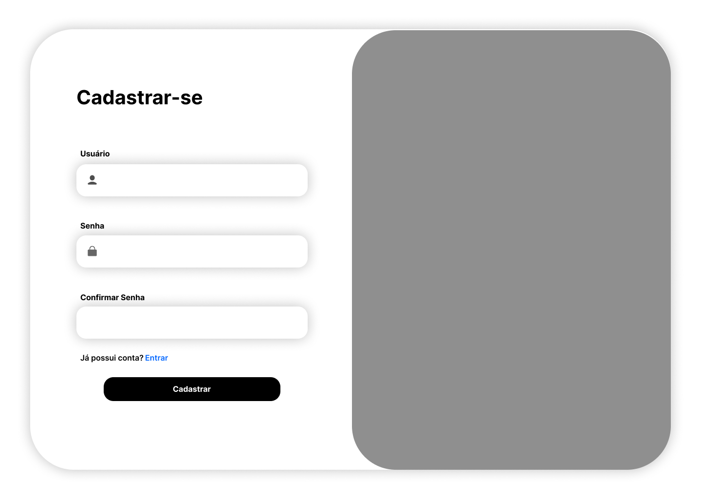

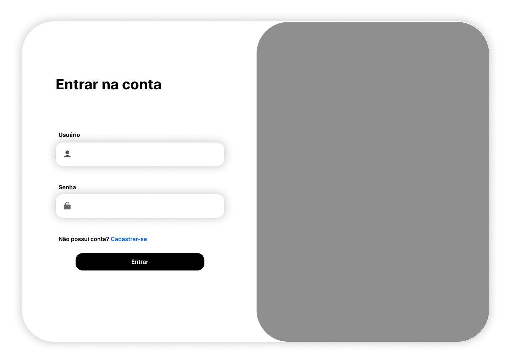

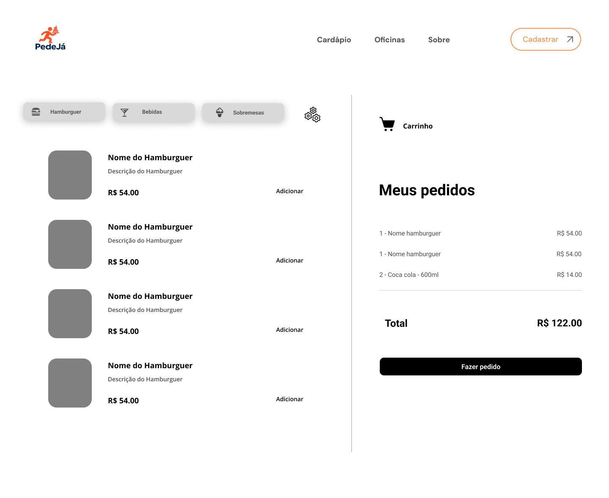

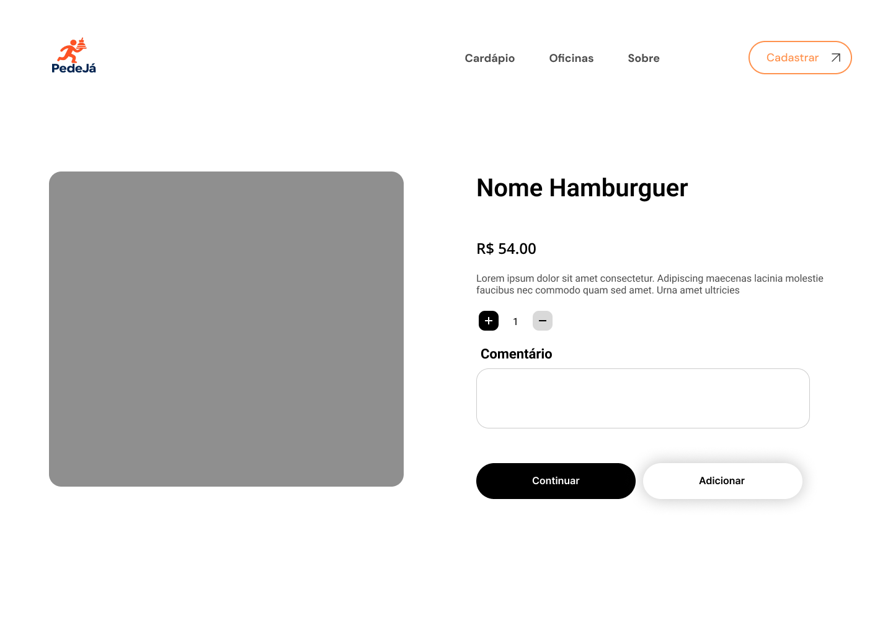

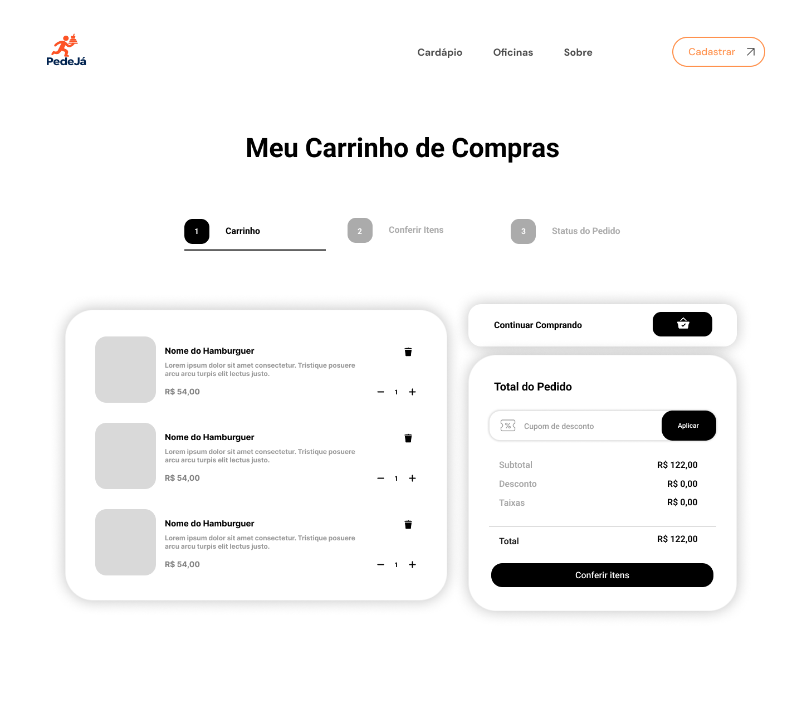

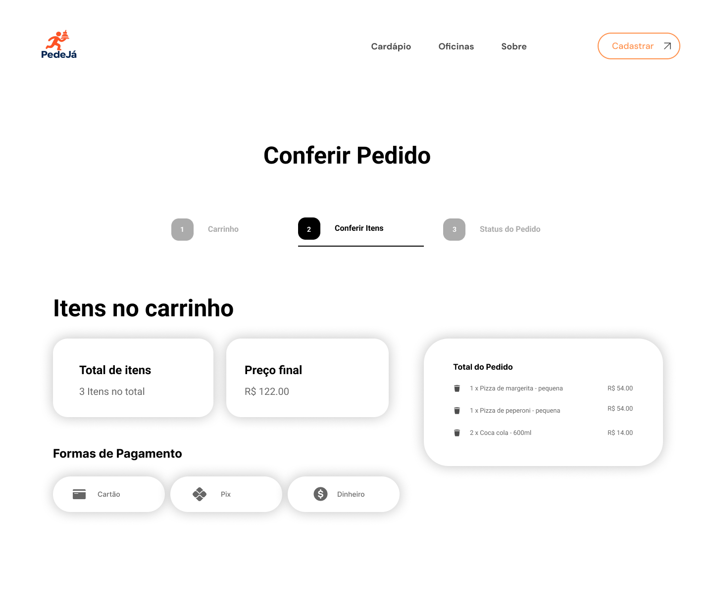

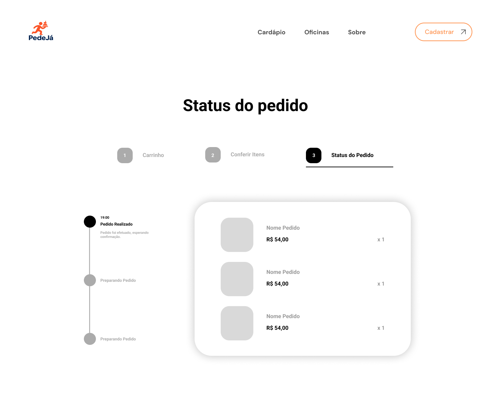

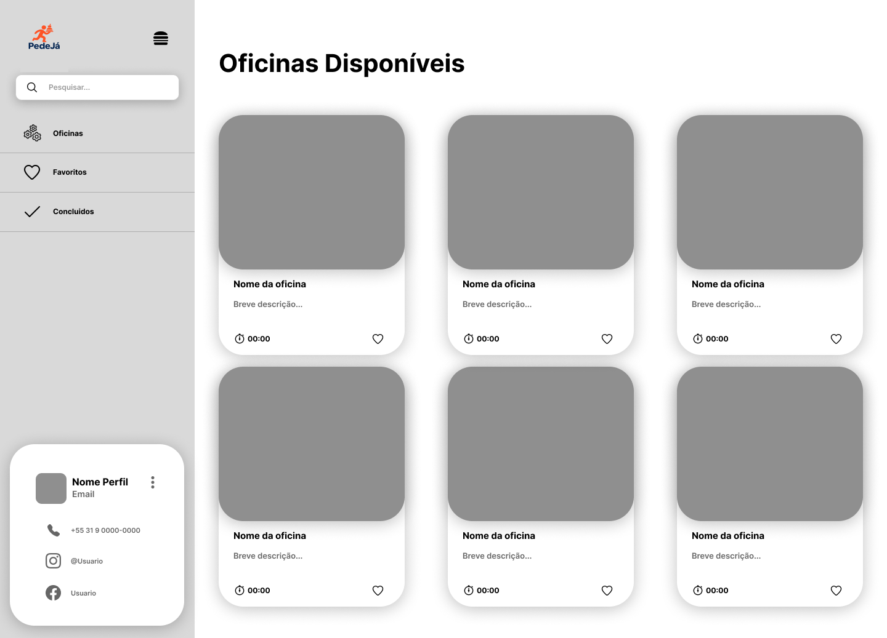

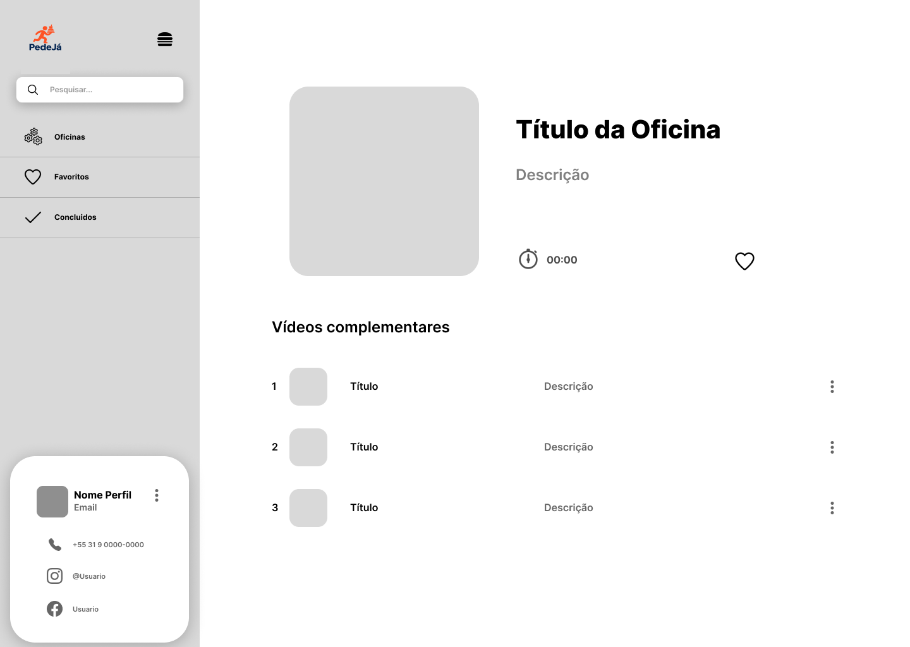

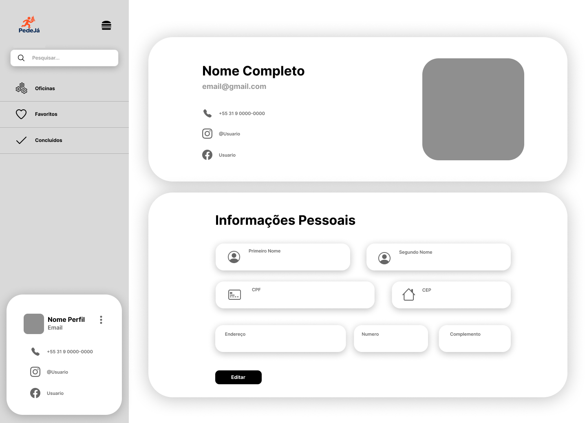

## Protótipo interativo

> **Links de acesso**:
> - [Visão de usuário](https://www.figma.com/proto/UorFcbfBTVIU2sHIwFHLb4/Untitled?node-id=0-1&p=f&viewport=109%2C243%2C0.1&t=ajld4VNc4pGNXc0a-0&scaling=min-zoom&content-scaling=fixed&starting-point-node-id=2%3A2&show-proto-sidebar=1)
> - [Visão de administrador](https://www.figma.com/proto/UorFcbfBTVIU2sHIwFHLb4/Untitled?node-id=0-1&p=f&viewport=109%2C243%2C0.1&t=ajld4VNc4pGNXc0a-0&scaling=min-zoom&content-scaling=fixed&starting-point-node-id=34%3A79&show-proto-sidebar=1)

## Jornada do usuário

Com base nas nossa personas e funcionalidade, ilustramos duas jornadas de usuários, uma da realização do pedido e a outra da inscrição nas oficinas.

Realização do pedido

Inscrição na oficina

## Interface do sistema
### Tela principal do sistema

Tela inicial da aplicação, aonde o usuário irá se deparar ao abrir o site.

### Telas dos processos BPMN

#### Processo 1

Tela a qual o usuário poderá navegar entre opções de diversos produtos podendo adiciona-los e exclui-los a qualquer momento. 

#### Processo 2

Tela a qual o usuário poderá navegar entre opções de diversos tipos de oficinas, podendo escolher a que mais se identifica

### Demais telas do sistema

As demias telas complementam o fluxo do usuário, podendo seguir o processo 1, adicionando e comprando produtos, ou o processo 2, navegando entre as oficinas disponibilizadas pelo proprietário.

