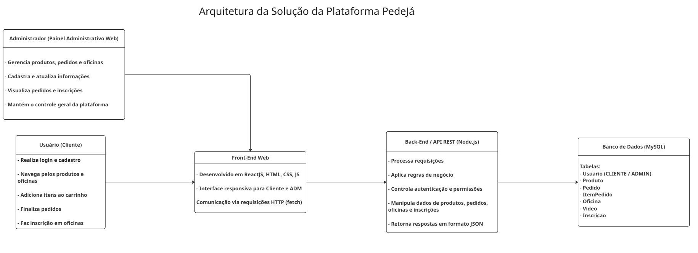
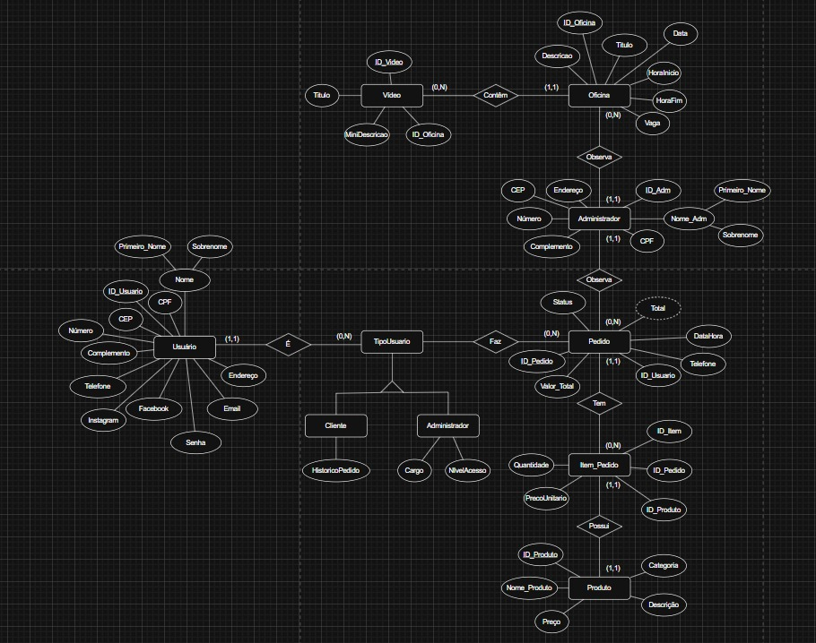
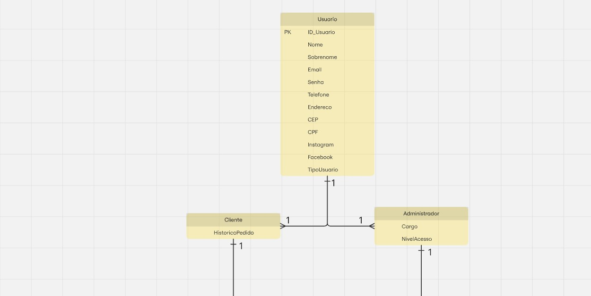
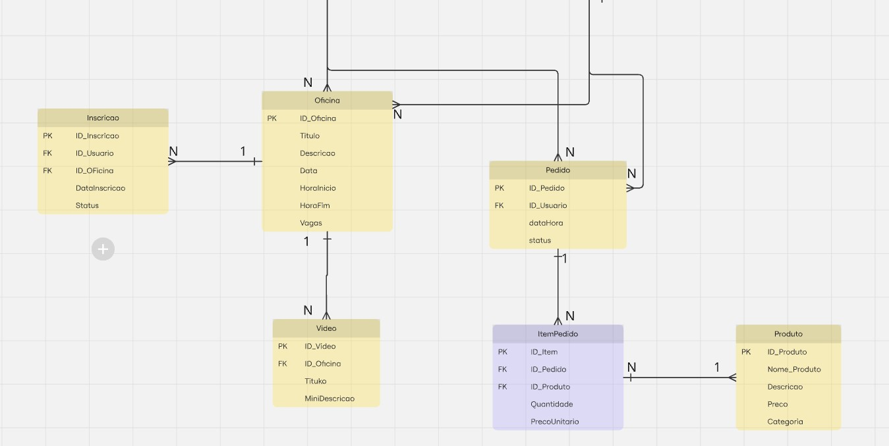

# Arquitetura da solução

<span style="color:red">Pré-requisitos: <a href="05-Projeto-interface.md"> Projeto de interface</a></span>

A plataforma PedeJá foi projetada para atender dois tipos de usuários distintos:

*Clientes, que realizam pedidos, acompanham o status e se inscrevem em oficinas.

*Administradores, que controlam produtos, pedidos, oficinas e cadastros de usuários.

Essa separação garante usabilidade personalizada e gestão eficiente do negócio, mantendo uma arquitetura centralizada que conecta ambas as interfaces a um único banco de dados e servidor.

O sistema é composto por quatro camadas principais:

<strong>Front-end (Interface de Usuário):</strong>

#Desenvolvido em ReactJS, HTML, CSS e JavaScript.

#Responsável pela interação visual e navegação dos dois perfis (cliente e administrador).

<strong>Back-end (Lógica de Negócio e API REST):</strong>

#Desenvolvido em Node.js (Express), responsável por processar requisições, autenticação e regras de negócio.

#Organizado em módulos que separam funções de clientes e administradores (autenticação, pedidos, produtos, oficinas, inscrições).

<strong>Banco de Dados (Persistência):</strong>

#Implementado em MySQL, armazenando dados de usuários, produtos, pedidos, itens de pedido, oficinas, vídeos e inscrições.

#O modelo segue as entidades identificadas nas telas e no modelo conceitual do projeto.

<strong>Hospedagem e Deploy:</strong>

#Vercel para o front-end (cliente e painel administrativo).

#Railway ou Render para o back-end e o banco de dados.

#A comunicação entre os componentes ocorre por requisições HTTP (API REST) com formato JSON, permitindo integração ágil e manutenção modular.

 

## Diagrama de classes

As classes do sistema refletem os dois perfis de acesso (cliente e administrador) e as entidades mapeadas a partir das telas e do modelo conceitual.

Classes principais:

<strong>Usuario (classe base)</strong>
<br>
Atributos: idUsuario, nome (primeiro e segundo nome), email, senha, telefone, endereco (rua, numero, complemento), CEP, CPF, Instagram (opcional), Facebook (opcional), tipoUsuario (enum: CLIENTE, ADMIN)

<strong>Cliente (herda de Usuario)</strong>
<br>
Atributos: historicoPedidos (ou referência aos pedidos do usuário)

<strong>Administrador (herda de Usuario)</strong>
<br>
Atributos: cargo, nivelAcesso

<strong>Produto</strong>
<br>
Atributos: idProduto, nome, descricao, preco, imagem, categoria (ex.: bebida, sobremesa, outros)

<strong>Pedido</strong>
<br>
Atributos: idPedido, idUsuario (referência ao Cliente), dataHora, status (PENDENTE, EM_PREPARO, PRONTO, RETIRADO, CANCELADO), valorTotal

<strong>ItemPedido</strong>
<br>
Atributos: idItem, idPedido, idProduto, quantidade, precoUnitario

<strong>Oficina</strong>
<br>
Atributos: idOficina, titulo, descricao, data, horaInicio, horaFim, vagas

<strong>Video</strong>
<br>
Atributos: idVideo, idOficina (FK → Oficina), titulo, miniDescricao

<strong>Inscricao</strong>
<br>
Atributos: idInscricao, idUsuario (FK → Usuario), idOficina (FK → Oficina), dataInscricao, status (CONFIRMADA, PENDENTE, CANCELADA)


 

##  Modelo de dados

O desenvolvimento da solução proposta requer a existência de bases de dados que permitam realizar o cadastro de dados e os controles associados aos processos identificados, assim como suas recuperações.

### Modelo conceitual 

 

### Modelo relacional

 

  


### Modelo físico

Segue abaixo o script de criação das tabelas do banco de dados.

```sql
CREATE TABLE Usuario (
    ID_Usuario     INT AUTO_INCREMENT NOT NULL,
    Nome           VARCHAR(60) NOT NULL,
    Sobrenome      VARCHAR(60),
    Email          VARCHAR(100) NOT NULL UNIQUE,
    Senha          VARCHAR(255) NOT NULL,
    Telefone       VARCHAR(20),
    Endereco       VARCHAR(150),
    CEP            VARCHAR(15),
    CPF            VARCHAR(14) UNIQUE,
    Instagram      VARCHAR(100),
    Facebook       VARCHAR(100),
    TipoUsuario    ENUM('Cliente','Administrador') NOT NULL,
    PRIMARY KEY (ID_Usuario)
);

CREATE TABLE Cliente (
    ID_Usuario     INT NOT NULL,
    HistoricoPedido TEXT,
    PRIMARY KEY (ID_Usuario),
    FOREIGN KEY (ID_Usuario) REFERENCES Usuario(ID_Usuario) ON DELETE CASCADE
);

CREATE TABLE Administrador (
    ID_Usuario     INT NOT NULL,
    Cargo          VARCHAR(60),
    NivelAcesso    ENUM('Baixo','Médio','Alto') DEFAULT 'Baixo',
    PRIMARY KEY (ID_Usuario),
    FOREIGN KEY (ID_Usuario) REFERENCES Usuario(ID_Usuario) ON DELETE CASCADE
);

CREATE TABLE Oficina (
    ID_Oficina     INT AUTO_INCREMENT NOT NULL,
    Titulo         VARCHAR(100) NOT NULL,
    Descricao      TEXT,
    Data           DATE NOT NULL,
    HoraInicio     TIME NOT NULL,
    HoraFim        TIME NOT NULL,
    Vagas          INT NOT NULL,
    PRIMARY KEY (ID_Oficina)
);

CREATE TABLE Inscricao (
    ID_Inscricao   INT AUTO_INCREMENT NOT NULL,
    ID_Usuario     INT NOT NULL,
    ID_Oficina     INT NOT NULL,
    DataInscricao  DATE NOT NULL,
    Status         ENUM('Ativa','Cancelada','Concluída') DEFAULT 'Ativa',
    PRIMARY KEY (ID_Inscricao),
    FOREIGN KEY (ID_Usuario) REFERENCES Usuario(ID_Usuario) ON DELETE CASCADE,
    FOREIGN KEY (ID_Oficina) REFERENCES Oficina(ID_Oficina) ON DELETE CASCADE
);

CREATE TABLE Video (
    ID_Video       INT AUTO_INCREMENT NOT NULL,
    ID_Oficina     INT NOT NULL,
    Titulo         VARCHAR(100) NOT NULL,
    MiniDescricao  TEXT,
    PRIMARY KEY (ID_Video),
    FOREIGN KEY (ID_Oficina) REFERENCES Oficina(ID_Oficina) ON DELETE CASCADE
);

CREATE TABLE Produto (
    ID_Produto     INT AUTO_INCREMENT NOT NULL,
    Foto           VARCHAR(255) NULL
    Nome_Produto   VARCHAR(100) NOT NULL,
    Descricao      TEXT,
    Preco          DECIMAL(10,2) NOT NULL,
    Categoria      VARCHAR(60),
    PRIMARY KEY (ID_Produto)
);

CREATE TABLE Pedido (
    ID_Pedido      INT AUTO_INCREMENT NOT NULL,
    ID_Usuario     INT NOT NULL,
    DataHora       DATETIME NOT NULL,
    Status         ENUM('Pendente','Pago','Cancelado') DEFAULT 'Pendente',
    PRIMARY KEY (ID_Pedido),
    FOREIGN KEY (ID_Usuario) REFERENCES Usuario(ID_Usuario) ON DELETE CASCADE
);

CREATE TABLE ItemPedido (
    ID_Item        INT AUTO_INCREMENT NOT NULL,
    ID_Pedido      INT NOT NULL,
    ID_Produto     INT NOT NULL,
    Quantidade     INT NOT NULL,
    PrecoUnitario  DECIMAL(10,2) NOT NULL,
    PRIMARY KEY (ID_Item),
    FOREIGN KEY (ID_Pedido) REFERENCES Pedido(ID_Pedido) ON DELETE CASCADE,
    FOREIGN KEY (ID_Produto) REFERENCES Produto(ID_Produto) ON DELETE CASCADE
);

```
Esse script deverá ser incluído em um arquivo .sql na pasta [de scripts SQL](../src/db).


## Tecnologias

Descreva as tecnologias utilizadas para implementar a solução proposta. Liste todas as tecnologias envolvidas, incluindo linguagens de programação, frameworks, bibliotecas, serviços web, IDEs, ferramentas de apoio e quaisquer outros recursos relevantes para o desenvolvimento.  

Apresente também um diagrama ou figura que ilustre a visão operacional, mostrando como as tecnologias interagem entre si durante o uso do sistema, desde a ação do usuário até a obtenção da resposta.

| **Dimensão**   | **Tecnologia**  |
| ---            | ---             |
| Front-end      | HTML + CSS + JS + React |
| Back-end       | Node.js         |
| SGBD           | MySQL           |
| Deploy         | Vercel          |


## Hospedagem

Explique como a hospedagem e o lançamento da plataforma foram realizados.

> **Links úteis**:
> - [Website com GitHub Pages](https://pages.github.com/)
> - [Programação colaborativa com Repl.it](https://repl.it/)
> - [Getting started with Heroku](https://devcenter.heroku.com/start)
> - [Publicando seu site no Heroku](http://pythonclub.com.br/publicando-seu-hello-world-no-heroku.html)

## Qualidade de software

Conceituar qualidade é uma tarefa complexa, mas ela pode ser vista como um método gerencial que, por meio de procedimentos disseminados por toda a organização, busca garantir um produto final que satisfaça às expectativas dos stakeholders.

No contexto do desenvolvimento de software, qualidade pode ser entendida como um conjunto de características a serem atendidas, de modo que o produto de software atenda às necessidades de seus usuários. Entretanto, esse nível de satisfação nem sempre é alcançado de forma espontânea, devendo ser continuamente construído. Assim, a qualidade do produto depende fortemente do seu respectivo processo de desenvolvimento.

A norma internacional ISO/IEC 25010, que é uma atualização da ISO/IEC 9126, define oito características e 30 subcaracterísticas de qualidade para produtos de software. Com base nessas características e nas respectivas subcaracterísticas, identifique as subcaracterísticas que sua equipe utilizará como base para nortear o desenvolvimento do projeto de software, considerando alguns aspectos simples de qualidade. Justifique as subcaracterísticas escolhidas pelo time e elenque as métricas que permitirão à equipe avaliar os objetos de interesse.

> **Links úteis**:
> - [ISO/IEC 25010:2011 - Systems and Software Engineering — Systems and Software Quality Requirements and Evaluation (SQuaRE) — System and Software Quality Models](https://www.iso.org/standard/35733.html/)
> - [Análise sobre a ISO 9126 – NBR 13596](https://www.tiespecialistas.com.br/analise-sobre-iso-9126-nbr-13596/)
> - [Qualidade de software - Engenharia de Software](https://www.devmedia.com.br/qualidade-de-software-engenharia-de-software-29/18209)
